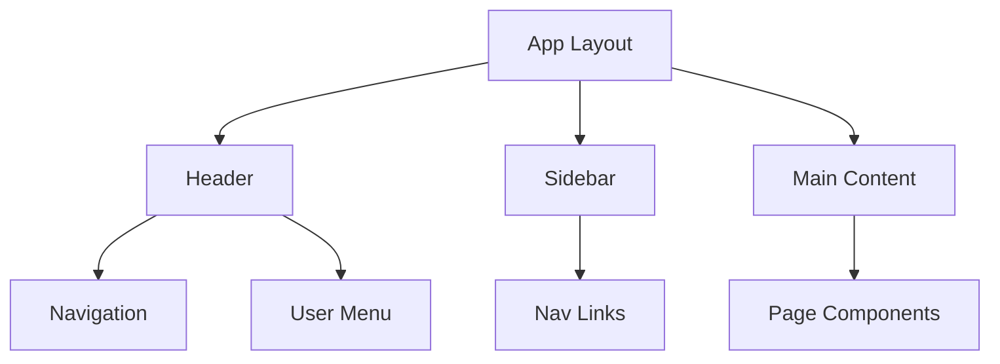

# Component Inventory Template

Use this template to document all UI components in the project.

```markdown
# {project_name} - Component Inventory

**Generated:** {date}
**Total Components:** {count}
**Design System:** {name or "Custom"}

## Component Overview

### Summary Statistics

| Category | Count |
|----------|-------|
| Layout Components | {count} |
| Form Components | {count} |
| Display Components | {count} |
| Navigation Components | {count} |
| Feedback Components | {count} |
| Utility Components | {count} |

### Component Locations

```
{project_root}/
├── components/           # Shared components
│   ├── ui/              # Base UI primitives
│   ├── forms/           # Form-specific components
│   ├── layout/          # Layout components
│   └── shared/          # Cross-feature components
├── features/            # Feature-specific components
│   └── {feature}/
│       └── components/
└── app/                 # Page components
    └── {route}/
        └── _components/
```

---

## Layout Components

### {ComponentName}

**Path:** `{path/to/component}`
**Category:** Layout

{Brief description of what the component does}

#### Props Interface

```typescript
interface {ComponentName}Props {
  {prop}: {type};        // {description}
  {prop}?: {type};       // {description} (optional)
  children?: ReactNode;  // Child content
}
```

#### Usage Example

```tsx
import { {ComponentName} } from '{import_path}';

<{ComponentName}
  {prop}={value}
>
  {children}
</{ComponentName}>
```

#### Variants

| Variant | Description |
|---------|-------------|
| `{variant}` | {description} |

---

## Form Components

### {FormComponent}

**Path:** `{path/to/component}`
**Category:** Form
**Form Library:** {react-hook-form / formik / native}

{Brief description}

#### Props Interface

```typescript
interface {FormComponent}Props {
  name: string;              // Field name for form registration
  label?: string;            // Field label
  placeholder?: string;      // Placeholder text
  validation?: ValidationRules;
  disabled?: boolean;
  error?: string;
}
```

#### Validation

| Rule | Type | Description |
|------|------|-------------|
| `required` | boolean | Field is required |
| `minLength` | number | Minimum character length |
| `pattern` | RegExp | Regex pattern to match |

#### Usage Example

```tsx
<{FormComponent}
  name="email"
  label="Email Address"
  validation={{ required: true, pattern: /^[^\s@]+@[^\s@]+\.[^\s@]+$/ }}
/>
```

---

## Display Components

### {DisplayComponent}

**Path:** `{path/to/component}`
**Category:** Display

{Brief description}

#### Props Interface

```typescript
interface {DisplayComponent}Props {
  data: {DataType};
  variant?: 'default' | 'compact' | 'detailed';
  loading?: boolean;
  error?: Error;
}
```

#### States

| State | Appearance |
|-------|------------|
| Loading | {description} |
| Error | {description} |
| Empty | {description} |
| Populated | {description} |

---

## Navigation Components

### {NavComponent}

**Path:** `{path/to/component}`
**Category:** Navigation

{Brief description}

#### Props Interface

```typescript
interface {NavComponent}Props {
  items: NavItem[];
  activeItem?: string;
  onNavigate?: (item: NavItem) => void;
}

interface NavItem {
  id: string;
  label: string;
  href: string;
  icon?: IconType;
}
```

---

## Feedback Components

### {FeedbackComponent}

**Path:** `{path/to/component}`
**Category:** Feedback
**Type:** {toast / modal / alert / notification}

{Brief description}

#### Props Interface

```typescript
interface {FeedbackComponent}Props {
  type: 'success' | 'error' | 'warning' | 'info';
  title: string;
  message?: string;
  duration?: number;
  onClose?: () => void;
}
```

#### Trigger Methods

```typescript
// Imperative usage
{feedbackService}.show({
  type: 'success',
  title: 'Saved!',
  message: 'Your changes have been saved.'
});
```

---

## Utility Components

### {UtilityComponent}

**Path:** `{path/to/component}`
**Category:** Utility

{Brief description - e.g., ErrorBoundary, Suspense wrapper, Portal}

---

## Design System Integration

### Theme Tokens

```typescript
// Colors
{
  primary: '{value}',
  secondary: '{value}',
  background: '{value}',
  text: '{value}',
  error: '{value}',
  success: '{value}',
}

// Spacing
{
  xs: '{value}',
  sm: '{value}',
  md: '{value}',
  lg: '{value}',
  xl: '{value}',
}

// Typography
{
  fontFamily: '{value}',
  fontSize: {
    sm: '{value}',
    base: '{value}',
    lg: '{value}',
  }
}
```

### Component Dependencies



---

## Component Patterns

### Composition Patterns

{Document common composition patterns used}

```tsx
// Compound Component Pattern
<Card>
  <Card.Header>Title</Card.Header>
  <Card.Body>Content</Card.Body>
  <Card.Footer>Actions</Card.Footer>
</Card>

// Render Props Pattern
<DataFetcher
  url="/api/data"
  render={({ data, loading }) => (
    loading ? <Spinner /> : <DataDisplay data={data} />
  )}
/>
```

### Accessibility Standards

| Standard | Implementation |
|----------|----------------|
| Keyboard Navigation | {description} |
| Screen Reader Support | {description} |
| Focus Management | {description} |
| Color Contrast | {description} |

---

## Component Testing

### Test Coverage

| Component | Unit | Integration | Visual |
|-----------|------|-------------|--------|
| {Component} | {yes/no} | {yes/no} | {yes/no} |

### Testing Utilities

```typescript
// Custom render with providers
import { render } from '@/test-utils';

render(<Component {...props} />);
```
```

---

## Usage Notes

When generating this template:

1. **Document every component** - No component should be omitted
2. **Include all props** - Full TypeScript interfaces required
3. **Show real examples** - Use actual usage from codebase
4. **Map dependencies** - Show component relationships
5. **Note accessibility** - Document a11y considerations
