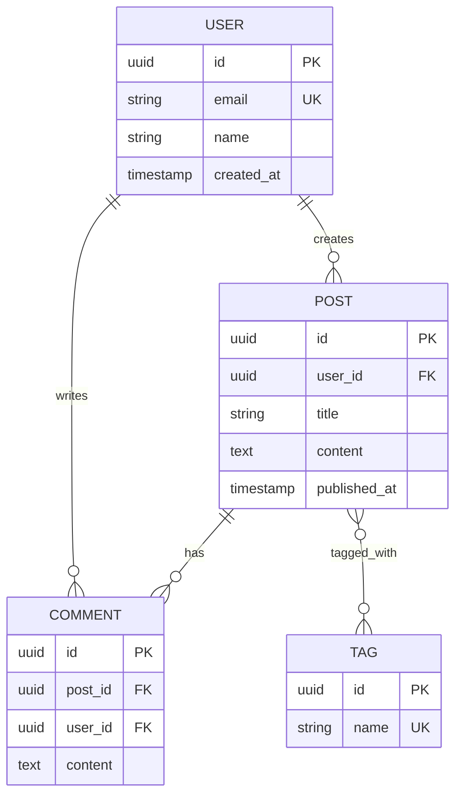
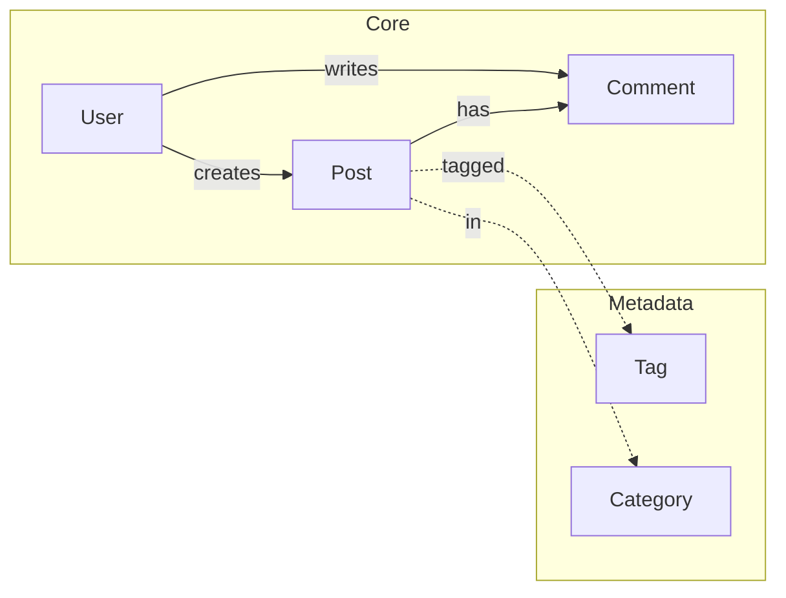

# Data Models Template

Use this template to document all database schemas and data models.

```markdown
# {project_name} - Data Models

**Generated:** {date}
**Database:** {PostgreSQL / MySQL / MongoDB / SQLite}
**ORM/ODM:** {Prisma / TypeORM / Drizzle / Mongoose / Raw SQL}
**Schema Location:** `{path/to/schema}`

## Data Architecture Overview

### Database Summary

| Metric | Count |
|--------|-------|
| Tables/Collections | {count} |
| Relationships | {count} |
| Indexes | {count} |
| Migrations | {count} |

### Entity Relationship Diagram



---

## Core Entities

### {EntityName}

**Table/Collection:** `{table_name}`
**Description:** {What this entity represents}

#### Schema Definition

```prisma
model {EntityName} {
  id        String   @id @default(uuid())

  // Fields
  email     String   @unique
  name      String
  role      Role     @default(USER)

  // Relations
  posts     Post[]
  comments  Comment[]

  // Timestamps
  createdAt DateTime @default(now())
  updatedAt DateTime @updatedAt
  deletedAt DateTime?

  // Indexes
  @@index([email])
  @@index([createdAt])
  @@map("users")
}
```

#### Field Details

| Field | Type | Constraints | Description |
|-------|------|-------------|-------------|
| `id` | UUID | PK, auto-generated | Unique identifier |
| `email` | String | Unique, required | User email address |
| `name` | String | Required, max 100 | Display name |
| `role` | Enum | Default: USER | User permission level |
| `createdAt` | DateTime | Auto-set | Record creation time |
| `updatedAt` | DateTime | Auto-update | Last modification time |
| `deletedAt` | DateTime | Nullable | Soft delete timestamp |

#### Relationships

| Relation | Type | Target | Description |
|----------|------|--------|-------------|
| `posts` | One-to-Many | Post | Posts created by user |
| `comments` | One-to-Many | Comment | Comments by user |
| `profile` | One-to-One | Profile | Extended user info |

#### Indexes

| Name | Fields | Type | Purpose |
|------|--------|------|---------|
| `users_email_key` | email | Unique | Email lookup |
| `users_created_at_idx` | createdAt | B-tree | Sorting by date |

#### Validation Rules

| Field | Validation |
|-------|------------|
| `email` | Valid email format |
| `name` | 1-100 characters |
| `password` | Min 8 chars, 1 uppercase, 1 number |

---

### {EntityName2}

**Table/Collection:** `{table_name}`
**Description:** {What this entity represents}

{Repeat schema documentation pattern...}

---

## Enums

### {EnumName}

```prisma
enum Role {
  USER
  ADMIN
  MODERATOR
}
```

| Value | Description |
|-------|-------------|
| `USER` | Standard user access |
| `ADMIN` | Full administrative access |
| `MODERATOR` | Content moderation access |

---

## Data Relationships

### Relationship Map



### Join Tables

#### {JoinTableName}

**Table:** `{table_name}`
**Purpose:** Many-to-many relationship between {Entity1} and {Entity2}

```sql
CREATE TABLE post_tags (
    post_id UUID REFERENCES posts(id) ON DELETE CASCADE,
    tag_id UUID REFERENCES tags(id) ON DELETE CASCADE,
    created_at TIMESTAMP DEFAULT NOW(),
    PRIMARY KEY (post_id, tag_id)
);
```

---

## Migrations

### Migration History

| Version | Name | Date | Status |
|---------|------|------|--------|
| 001 | `create_users` | {date} | Applied |
| 002 | `create_posts` | {date} | Applied |
| 003 | `add_soft_delete` | {date} | Applied |
| 004 | `create_tags` | {date} | Pending |

### Running Migrations

```bash
# Apply all pending migrations
{migration_command}

# Rollback last migration
{rollback_command}

# Generate new migration
{generate_command}

# Reset database (destructive)
{reset_command}
```

---

## Data Access Patterns

### Repository Pattern

```typescript
// {Entity}Repository
interface {Entity}Repository {
  findById(id: string): Promise<{Entity} | null>;
  findByEmail(email: string): Promise<{Entity} | null>;
  findMany(filters: {Entity}Filters): Promise<{Entity}[]>;
  create(data: Create{Entity}Input): Promise<{Entity}>;
  update(id: string, data: Update{Entity}Input): Promise<{Entity}>;
  delete(id: string): Promise<void>;
}
```

### Common Queries

```typescript
// Find with relations
const user = await prisma.user.findUnique({
  where: { id },
  include: {
    posts: true,
    profile: true,
  },
});

// Paginated list
const posts = await prisma.post.findMany({
  where: { published: true },
  orderBy: { createdAt: 'desc' },
  skip: (page - 1) * limit,
  take: limit,
});

// Aggregations
const stats = await prisma.post.aggregate({
  _count: true,
  _avg: { views: true },
});
```

---

## Data Validation

### Input Schemas (Zod)

```typescript
import { z } from 'zod';

export const create{Entity}Schema = z.object({
  email: z.string().email(),
  name: z.string().min(1).max(100),
  password: z.string().min(8).regex(/[A-Z]/).regex(/[0-9]/),
});

export const update{Entity}Schema = create{Entity}Schema.partial();

export type Create{Entity}Input = z.infer<typeof create{Entity}Schema>;
export type Update{Entity}Input = z.infer<typeof update{Entity}Schema>;
```

---

## Seeding

### Seed Data Location

`{path/to/seeds}`

### Running Seeds

```bash
# Run all seeds
{seed_command}

# Run specific seed
{specific_seed_command}
```

### Seed Structure

```typescript
// seeds/{entity}.seed.ts
export async function seed{Entity}s(prisma: PrismaClient) {
  await prisma.{entity}.createMany({
    data: [
      { /* seed data */ },
    ],
  });
}
```

---

## Performance Considerations

### Indexes Strategy

| Query Pattern | Index | Justification |
|---------------|-------|---------------|
| User lookup by email | `users_email_key` | Frequent auth queries |
| Posts by date | `posts_created_at_idx` | Feed pagination |
| Full-text search | `posts_content_gin` | Content search |

### Query Optimization Notes

{Document any N+1 issues, slow queries, or optimization patterns}

---

## Backup and Recovery

### Backup Strategy

| Type | Frequency | Retention |
|------|-----------|-----------|
| Full backup | Daily | 30 days |
| Point-in-time | Continuous | 7 days |
| Snapshots | Weekly | 90 days |

### Recovery Procedures

```bash
# Restore from backup
{restore_command}

# Point-in-time recovery
{pitr_command}
```
```

---

## Usage Notes

When generating this template:

1. **Document every entity** - All tables/collections
2. **Show relationships** - Foreign keys, joins
3. **Include migrations** - Full migration history
4. **Add ER diagrams** - Visual relationship maps
5. **Document indexes** - Performance considerations
