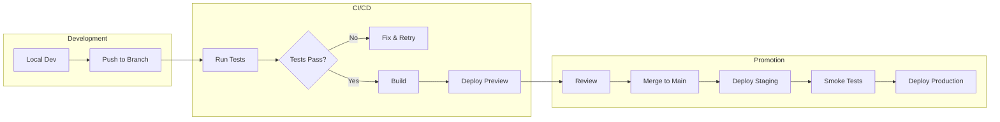
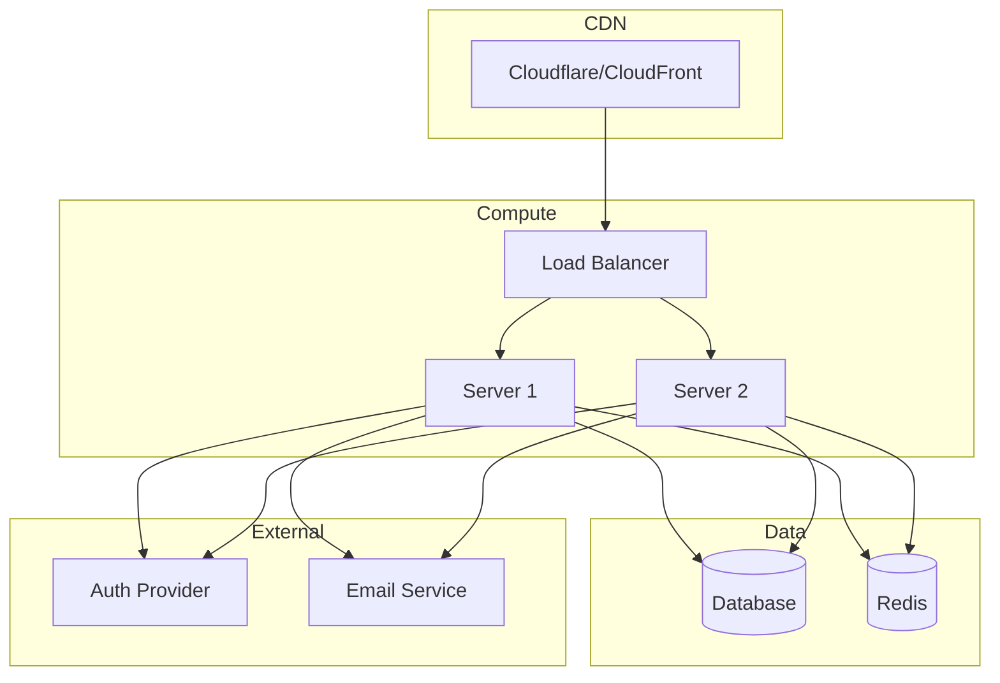

# Deployment Guide Template

Use this template to document the deployment process and infrastructure.

```markdown
# {project_name} - Deployment Guide

**Generated:** {date}
**Hosting:** {Vercel / AWS / GCP / Azure / Self-hosted}
**CI/CD:** {GitHub Actions / GitLab CI / CircleCI / Jenkins}

## Deployment Overview

### Environments

| Environment | URL | Branch | Auto Deploy |
|-------------|-----|--------|-------------|
| Production | `{prod_url}` | `main` | {Yes/No} |
| Staging | `{staging_url}` | `staging` | {Yes/No} |
| Preview | `{preview_url_pattern}` | PR branches | Yes |
| Development | `localhost:3000` | - | - |

### Deployment Flow



---

## Prerequisites

### Required Tools

| Tool | Version | Purpose |
|------|---------|---------|
| {tool} | {version} | {purpose} |
| {tool} | {version} | {purpose} |

### Access Requirements

| Resource | Access Type | How to Request |
|----------|-------------|----------------|
| {Cloud Provider} | Admin/Deploy | {process} |
| {Container Registry} | Push/Pull | {process} |
| {Secrets Manager} | Read | {process} |

### Environment Setup

```bash
# Install deployment dependencies
{install_command}

# Authenticate with cloud provider
{auth_command}

# Verify access
{verify_command}
```

---

## Build Process

### Build Commands

```bash
# Development build
{dev_build_command}

# Production build
{prod_build_command}

# Build with analysis
{analyze_command}
```

### Build Output

| Output | Location | Contents |
|--------|----------|----------|
| Static files | `{output_dir}` | HTML, CSS, JS |
| Server bundle | `{server_dir}` | Node.js server |
| Assets | `{assets_dir}` | Images, fonts |

### Build Configuration

```typescript
// build.config.ts / next.config.js / vite.config.ts
{
  output: '{output_type}',
  minify: true,
  sourcemap: '{sourcemap_setting}',
  // ...
}
```

### Environment Variables at Build Time

| Variable | Purpose | Required |
|----------|---------|----------|
| `{VAR}` | {purpose} | {Yes/No} |

---

## Deployment Methods

### Method 1: {Primary Method}

{Description of primary deployment method}

```bash
# Deploy to production
{deploy_command}

# Deploy to staging
{staging_deploy_command}

# Deploy specific version
{version_deploy_command}
```

### Method 2: {Alternative Method}

{Description of alternative method}

```bash
{alternative_deploy_commands}
```

---

## CI/CD Pipeline

### Pipeline Configuration

**File:** `{.github/workflows/deploy.yml}`

```yaml
name: Deploy

on:
  push:
    branches: [main, staging]
  pull_request:
    branches: [main]

jobs:
  test:
    runs-on: ubuntu-latest
    steps:
      - uses: actions/checkout@v4
      - uses: actions/setup-node@v4
        with:
          node-version: '{version}'
      - run: {install_command}
      - run: {test_command}

  build:
    needs: test
    runs-on: ubuntu-latest
    steps:
      - uses: actions/checkout@v4
      - run: {build_command}
      - uses: actions/upload-artifact@v4
        with:
          name: build
          path: {output_dir}

  deploy:
    needs: build
    runs-on: ubuntu-latest
    if: github.ref == 'refs/heads/main'
    steps:
      - uses: actions/download-artifact@v4
      - run: {deploy_command}
        env:
          {DEPLOY_TOKEN}: ${{ secrets.{SECRET_NAME} }}
```

### Pipeline Stages

| Stage | Trigger | Actions | Duration |
|-------|---------|---------|----------|
| Test | All pushes | Lint, Type check, Tests | ~{time} |
| Build | On test pass | Production build | ~{time} |
| Deploy Preview | PRs | Deploy to preview URL | ~{time} |
| Deploy Staging | Merge to staging | Deploy to staging | ~{time} |
| Deploy Production | Merge to main | Deploy to production | ~{time} |

### Required Secrets

| Secret | Purpose | How to Set |
|--------|---------|------------|
| `{SECRET_NAME}` | {purpose} | {location} |

---

## Infrastructure

### Architecture Diagram



### Infrastructure Components

| Component | Service | Purpose |
|-----------|---------|---------|
| Hosting | {service} | Application hosting |
| Database | {service} | Data storage |
| Cache | {service} | Session/data caching |
| CDN | {service} | Static asset delivery |
| DNS | {service} | Domain management |

### Scaling Configuration

| Resource | Min | Max | Trigger |
|----------|-----|-----|---------|
| Instances | {min} | {max} | CPU > {threshold}% |
| Database | {size} | {size} | Manual |

---

## Database Migrations

### Running Migrations

```bash
# Check pending migrations
{migration_status_command}

# Run migrations (staging)
{migration_command_staging}

# Run migrations (production)
{migration_command_production}

# Rollback last migration
{rollback_command}
```

### Migration Safety

- [ ] Migrations are backwards compatible
- [ ] Large tables use batched updates
- [ ] Indexes created concurrently
- [ ] Tested on staging first

---

## Monitoring and Logging

### Monitoring Tools

| Tool | Purpose | Dashboard |
|------|---------|-----------|
| {tool} | APM/Performance | {url} |
| {tool} | Error tracking | {url} |
| {tool} | Uptime monitoring | {url} |

### Log Access

```bash
# View production logs
{log_command}

# Stream logs
{log_stream_command}

# Search logs
{log_search_command}
```

### Alerts

| Alert | Condition | Notification |
|-------|-----------|--------------|
| High Error Rate | Errors > {threshold}/min | {channel} |
| High Latency | P95 > {threshold}ms | {channel} |
| Down | Uptime check fails | {channel} |

---

## Rollback Procedures

### Quick Rollback

```bash
# Rollback to previous deployment
{rollback_command}

# Rollback to specific version
{rollback_version_command}

# Verify rollback
{verify_command}
```

### Rollback Checklist

1. [ ] Identify the issue and affected version
2. [ ] Notify team in {channel}
3. [ ] Execute rollback command
4. [ ] Verify application health
5. [ ] Check database compatibility
6. [ ] Monitor for issues
7. [ ] Document incident

### Database Rollback

```bash
# Rollback database migration
{db_rollback_command}

# Note: May require coordination with app rollback
```

---

## Security

### SSL/TLS

| Domain | Certificate | Auto-Renew |
|--------|-------------|------------|
| {domain} | {provider} | Yes |

### Security Headers

```
Strict-Transport-Security: max-age=31536000; includeSubDomains
X-Content-Type-Options: nosniff
X-Frame-Options: DENY
Content-Security-Policy: {policy}
```

### Secrets Rotation

| Secret | Rotation | Process |
|--------|----------|---------|
| {secret} | {frequency} | {process} |

---

## Disaster Recovery

### Backup Schedule

| Data | Frequency | Retention | Location |
|------|-----------|-----------|----------|
| Database | {freq} | {days} days | {location} |
| File storage | {freq} | {days} days | {location} |

### Recovery Procedures

```bash
# Restore database from backup
{restore_command}

# Restore to point in time
{pitr_command}
```

### RTO/RPO

| Metric | Target | Current |
|--------|--------|
| RTO (Recovery Time) | {target} | {current} |
| RPO (Recovery Point) | {target} | {current} |

---

## Troubleshooting

### Common Issues

| Issue | Symptoms | Resolution |
|-------|----------|------------|
| Build fails | {symptoms} | {resolution} |
| Deploy timeout | {symptoms} | {resolution} |
| Health check fails | {symptoms} | {resolution} |

### Debug Commands

```bash
# Check deployment status
{status_command}

# View recent deployments
{history_command}

# Check service health
{health_command}
```

### Support Contacts

| Issue Type | Contact | Response Time |
|------------|---------|---------------|
| Infrastructure | {contact} | {sla} |
| Application | {contact} | {sla} |
| Security | {contact} | {sla} |
```

---

## Usage Notes

When generating this template:

1. **Document all environments** - Dev, staging, prod
2. **Include CI/CD config** - Full pipeline YAML
3. **Show infrastructure** - Architecture diagrams
4. **Cover rollback** - Step-by-step procedures
5. **List monitoring** - Tools and access
