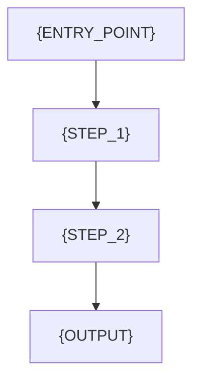
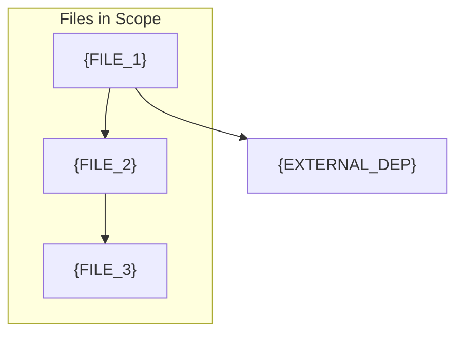

# {TARGET_NAME} - Deep Dive Documentation

**Generated:** {DATE}
**Scope:** `{TARGET_PATH}`
**Files Analyzed:** {FILE_COUNT}
**Lines of Code:** {TOTAL_LOC}
**Scan Mode:** Exhaustive Deep-Dive

## Overview

{TARGET_DESCRIPTION}

**Purpose:** {TARGET_PURPOSE}
**Key Responsibilities:**
- {RESPONSIBILITY_1}
- {RESPONSIBILITY_2}
- {RESPONSIBILITY_3}

**Integration Points:** {INTEGRATION_SUMMARY}

---

## Complete File Inventory

<!-- Repeat this section for each file in scope -->

### `{FILE_PATH}`

**Purpose:** {FILE_PURPOSE}
**Lines of Code:** {LOC}
**File Type:** {FILE_TYPE}

#### Exports

| Export | Type | Description |
|--------|------|-------------|
| `{EXPORT_NAME}` | {function/class/type/const} | {DESCRIPTION} |

**Function Signatures:**
```typescript
// Main exports with full signatures
{FUNCTION_SIGNATURE_1}
{FUNCTION_SIGNATURE_2}
```

#### Dependencies

| Import | From | Why Used |
|--------|------|----------|
| `{IMPORT}` | `{FROM_PATH}` | {REASON} |

#### Used By (Dependents)

- `{DEPENDENT_FILE_1}` - {HOW_USED}
- `{DEPENDENT_FILE_2}` - {HOW_USED}

#### Key Implementation Details

```{LANGUAGE}
{KEY_CODE_SNIPPET}
```

{IMPLEMENTATION_NOTES}

#### Patterns Used

- **{PATTERN_NAME}:** {HOW_PATTERN_IS_USED}

#### State Management

{STATE_APPROACH_FOR_THIS_FILE}

#### Side Effects

| Effect Type | Description | Location |
|-------------|-------------|----------|
| API Call | {DESCRIPTION} | Line {N} |
| Database | {DESCRIPTION} | Line {N} |
| File I/O | {DESCRIPTION} | Line {N} |

#### Error Handling

{ERROR_HANDLING_APPROACH}

#### Testing

- **Test File:** `{TEST_FILE_PATH}`
- **Coverage:** {COVERAGE}%
- **Test Approach:** {TESTING_APPROACH}

#### Comments & TODOs

| Line | Type | Content |
|------|------|---------|
| {LINE} | TODO | {CONTENT} |
| {LINE} | FIXME | {CONTENT} |

---

<!-- End file inventory section -->

## Architecture & Design Patterns

### Code Organization

{ORGANIZATION_APPROACH}

### Design Patterns Used

| Pattern | Usage | Example File |
|---------|-------|--------------|
| {PATTERN} | {USAGE} | `{FILE}` |

### State Management Strategy

{STATE_MANAGEMENT_DETAILS}

### Error Handling Philosophy

{ERROR_PHILOSOPHY}

### Testing Strategy

{TESTING_STRATEGY}

---

## Data Flow



### Data Entry Points

| Entry Point | Description | Data Shape |
|-------------|-------------|------------|
| {ENTRY} | {DESCRIPTION} | `{TYPE}` |

### Data Transformations

| Transformation | Input | Output | Location |
|----------------|-------|--------|----------|
| {NAME} | `{INPUT_TYPE}` | `{OUTPUT_TYPE}` | `{FILE}` |

### Data Exit Points

| Exit Point | Description | Consumer |
|------------|-------------|----------|
| {EXIT} | {DESCRIPTION} | {WHO_CONSUMES} |

---

## Integration Points

### APIs Consumed

| Endpoint | Method | Auth | Purpose |
|----------|--------|------|---------|
| `{ENDPOINT}` | {METHOD} | {AUTH} | {PURPOSE} |

### APIs Exposed

| Endpoint | Method | Request | Response |
|----------|--------|---------|----------|
| `{ENDPOINT}` | {METHOD} | `{REQUEST_TYPE}` | `{RESPONSE_TYPE}` |

### Shared State

| State | Type | Accessed By |
|-------|------|-------------|
| {STATE_NAME} | `{TYPE}` | {FILES} |

### Events

| Event | Type | Payload |
|-------|------|---------|
| {EVENT_NAME} | {PUB/SUB} | `{PAYLOAD_TYPE}` |

### Database Access

| Table | Operations | Key Queries |
|-------|------------|-------------|
| `{TABLE}` | {CRUD_OPS} | {QUERY_PATTERNS} |

---

## Dependency Graph



### Entry Points (Not imported by others in scope)

- `{ENTRY_FILE_1}`
- `{ENTRY_FILE_2}`

### Leaf Nodes (Don't import others in scope)

- `{LEAF_FILE_1}`
- `{LEAF_FILE_2}`

### Circular Dependencies

<!-- If none: -->
No circular dependencies detected

<!-- If found: -->
Circular dependencies detected:
- `{FILE_A}` ↔ `{FILE_B}`: {DESCRIPTION}

---

## Testing Analysis

### Test Coverage Summary

| Metric | Coverage |
|--------|----------|
| Statements | {N}% |
| Branches | {N}% |
| Functions | {N}% |
| Lines | {N}% |

### Test Files

| Test File | Tests | Approach | Mocking |
|-----------|-------|----------|---------|
| `{TEST_FILE}` | {COUNT} | {APPROACH} | {MOCKING_STRATEGY} |

### Testing Gaps

- {GAP_1}
- {GAP_2}

### Test Utilities Available

| Utility | Purpose | Location |
|---------|---------|----------|
| `{UTILITY}` | {PURPOSE} | `{PATH}` |

---

## Related Code & Reuse Opportunities

### Similar Features Elsewhere

| Feature | Location | Similarity | Reference For |
|---------|----------|------------|---------------|
| {FEATURE} | `{PATH}` | {DESCRIPTION} | {USE_CASE} |

### Reusable Utilities Available

| Utility | Location | Purpose |
|---------|----------|---------|
| `{UTILITY}` | `{PATH}` | {PURPOSE} |

### Patterns to Follow

| Pattern | Reference Implementation |
|---------|-------------------------|
| {PATTERN} | `{FILE}` |

---

## Implementation Notes

### Code Quality Observations

- {OBSERVATION_1}
- {OBSERVATION_2}

### TODOs and Future Work

| File | Line | TODO |
|------|------|------|
| `{FILE}` | {LINE} | {TODO_TEXT} |

### Known Issues

- {ISSUE_1}
- {ISSUE_2}

### Technical Debt

- {DEBT_ITEM_1}
- {DEBT_ITEM_2}

### Optimization Opportunities

- {OPTIMIZATION_1}
- {OPTIMIZATION_2}

---

## Modification Guidance

### To Add New Functionality

1. {STEP_1}
2. {STEP_2}
3. {STEP_3}

**Key files to modify:** `{FILE_1}`, `{FILE_2}`

### To Modify Existing Functionality

1. {STEP_1}
2. {STEP_2}

**Impact areas:** {IMPACT_DESCRIPTION}

### To Remove/Deprecate

1. {STEP_1}
2. {STEP_2}

**Dependencies to update:** {DEPENDENT_FILES}

### Testing Checklist for Changes

- [ ] Unit tests pass
- [ ] Integration tests pass
- [ ] No new linter errors
- [ ] Type checking passes
- [ ] Related tests updated
- [ ] Documentation updated
- [ ] No breaking changes (or documented)

---

_Generated by project-documentation skill (deep-dive mode)_
_Base Index: docs/index.md_
