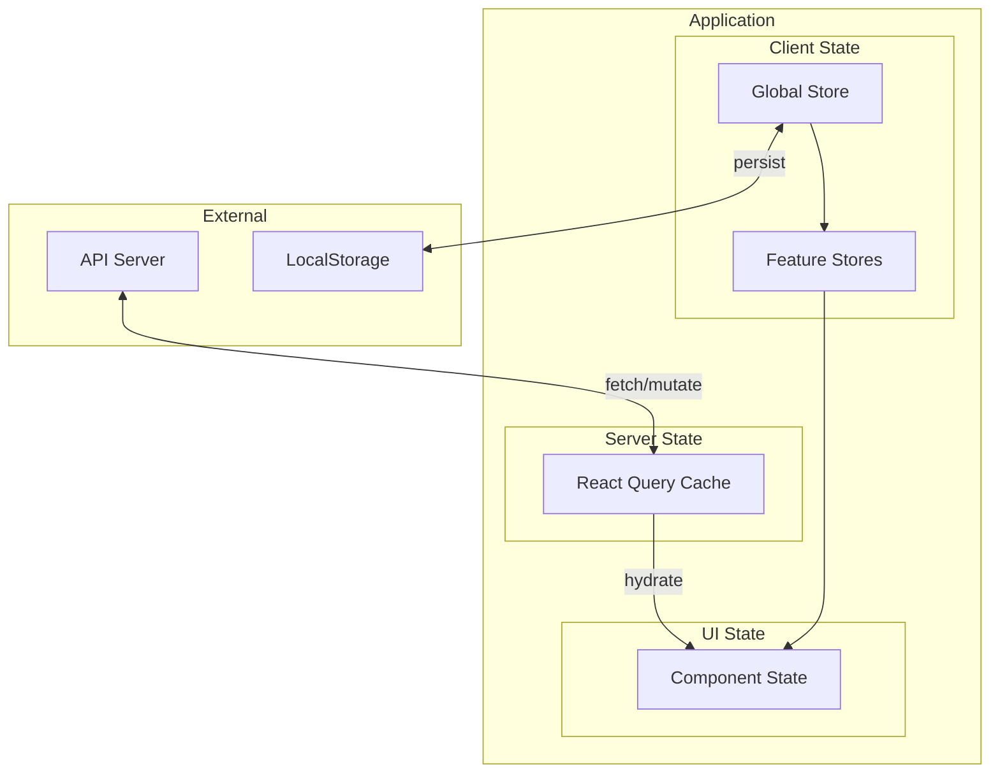

# State Management Template

Use this template to document application state management patterns.

```markdown
# {project_name} - State Management

**Generated:** {date}
**State Solution:** {Redux / Zustand / Context / Jotai / Pinia / MobX}
**Store Location:** `{path/to/stores}`

## State Architecture Overview

### State Categories

| Category | Solution | Scope | Persistence |
|----------|----------|-------|-------------|
| Global App State | {Zustand} | Application-wide | {LocalStorage} |
| Server State | {React Query} | Data fetching | {Memory + Cache} |
| Form State | {React Hook Form} | Per-form | None |
| UI State | {useState/Context} | Component/Feature | None |
| URL State | {Router} | Navigation | URL |

### State Flow Diagram



---

## Global State

### Store Structure

```typescript
// stores/index.ts
interface RootState {
  auth: AuthState;
  ui: UIState;
  settings: SettingsState;
}
```

### {StoreName} Store

**Path:** `{path/to/store}`
**Purpose:** {What this store manages}

#### State Shape

```typescript
interface {StoreName}State {
  // Data
  {field}: {Type};
  {field}: {Type}[];

  // Loading states
  isLoading: boolean;
  error: Error | null;

  // Derived
  computed: ComputedType;
}
```

#### Actions

| Action | Payload | Description |
|--------|---------|-------------|
| `{actionName}` | `{PayloadType}` | {What it does} |
| `{actionName}` | `{PayloadType}` | {What it does} |
| `reset` | none | Reset to initial state |

#### Implementation

```typescript
// stores/{storeName}.ts
import { create } from 'zustand';
import { persist } from 'zustand/middleware';

interface {StoreName}State {
  // State
  items: Item[];
  selectedId: string | null;
  isLoading: boolean;

  // Actions
  setItems: (items: Item[]) => void;
  selectItem: (id: string) => void;
  addItem: (item: Item) => void;
  removeItem: (id: string) => void;
  reset: () => void;
}

const initialState = {
  items: [],
  selectedId: null,
  isLoading: false,
};

export const use{StoreName}Store = create<{StoreName}State>()(
  persist(
    (set, get) => ({
      ...initialState,

      setItems: (items) => set({ items }),

      selectItem: (id) => set({ selectedId: id }),

      addItem: (item) => set((state) => ({
        items: [...state.items, item],
      })),

      removeItem: (id) => set((state) => ({
        items: state.items.filter((item) => item.id !== id),
      })),

      reset: () => set(initialState),
    }),
    {
      name: '{store-name}-storage',
      partialize: (state) => ({ items: state.items }),
    }
  )
);
```

#### Selectors

```typescript
// Derived state selectors
export const selectSelectedItem = (state: {StoreName}State) =>
  state.items.find((item) => item.id === state.selectedId);

export const selectItemCount = (state: {StoreName}State) =>
  state.items.length;

export const selectFilteredItems = (filter: string) =>
  (state: {StoreName}State) =>
    state.items.filter((item) => item.name.includes(filter));
```

#### Usage

```tsx
function Component() {
  // Access state
  const items = use{StoreName}Store((state) => state.items);
  const isLoading = use{StoreName}Store((state) => state.isLoading);

  // Access actions
  const addItem = use{StoreName}Store((state) => state.addItem);

  // Use selector
  const selectedItem = use{StoreName}Store(selectSelectedItem);

  return (/* ... */);
}
```

---

## Server State (Data Fetching)

### Query Configuration

**Library:** {React Query / SWR / Apollo}
**Cache Time:** {default cache duration}
**Stale Time:** {default stale duration}

### Query Keys

```typescript
// queryKeys.ts
export const queryKeys = {
  {resource}: {
    all: ['{resource}'] as const,
    lists: () => [...queryKeys.{resource}.all, 'list'] as const,
    list: (filters: Filters) => [...queryKeys.{resource}.lists(), filters] as const,
    details: () => [...queryKeys.{resource}.all, 'detail'] as const,
    detail: (id: string) => [...queryKeys.{resource}.details(), id] as const,
  },
};
```

### Queries

#### {QueryName}

**Key:** `{queryKey}`
**Endpoint:** `GET {endpoint}`

```typescript
// hooks/use{Resource}.ts
export function use{Resource}s(filters?: Filters) {
  return useQuery({
    queryKey: queryKeys.{resource}.list(filters),
    queryFn: () => api.{resource}.list(filters),
    staleTime: 5 * 60 * 1000, // 5 minutes
  });
}

export function use{Resource}(id: string) {
  return useQuery({
    queryKey: queryKeys.{resource}.detail(id),
    queryFn: () => api.{resource}.get(id),
    enabled: !!id,
  });
}
```

### Mutations

#### {MutationName}

**Action:** {Create / Update / Delete}
**Endpoint:** `{METHOD} {endpoint}`

```typescript
export function useCreate{Resource}() {
  const queryClient = useQueryClient();

  return useMutation({
    mutationFn: (data: Create{Resource}Input) => api.{resource}.create(data),
    onSuccess: () => {
      queryClient.invalidateQueries({
        queryKey: queryKeys.{resource}.lists(),
      });
    },
  });
}
```

---

## Form State

### Form Library

**Library:** {React Hook Form / Formik}
**Validation:** {Zod / Yup}

### Form Patterns

```typescript
// Example form with validation
import { useForm } from 'react-hook-form';
import { zodResolver } from '@hookform/resolvers/zod';
import { z } from 'zod';

const schema = z.object({
  name: z.string().min(1, 'Required'),
  email: z.string().email('Invalid email'),
});

type FormData = z.infer<typeof schema>;

function {Form}Form() {
  const {
    register,
    handleSubmit,
    formState: { errors, isSubmitting },
  } = useForm<FormData>({
    resolver: zodResolver(schema),
  });

  const onSubmit = async (data: FormData) => {
    // Handle submission
  };

  return (
    <form onSubmit={handleSubmit(onSubmit)}>
      {/* Form fields */}
    </form>
  );
}
```

---

## UI State

### Local Component State

```typescript
// Simple UI state patterns
const [isOpen, setIsOpen] = useState(false);
const [activeTab, setActiveTab] = useState<TabId>('overview');
const [searchQuery, setSearchQuery] = useState('');
```

### Feature-Scoped Context

```typescript
// features/{feature}/context.tsx
interface {Feature}ContextValue {
  state: {Feature}State;
  actions: {Feature}Actions;
}

const {Feature}Context = createContext<{Feature}ContextValue | null>(null);

export function {Feature}Provider({ children }: PropsWithChildren) {
  const [state, dispatch] = useReducer(reducer, initialState);

  const actions = useMemo(() => ({
    doSomething: () => dispatch({ type: 'DO_SOMETHING' }),
  }), []);

  return (
    <{Feature}Context.Provider value={{ state, actions }}>
      {children}
    </{Feature}Context.Provider>
  );
}

export function use{Feature}() {
  const context = useContext({Feature}Context);
  if (!context) {
    throw new Error('use{Feature} must be used within {Feature}Provider');
  }
  return context;
}
```

---

## State Persistence

### Persistence Strategy

| Store | Storage | Sync |
|-------|---------|------|
| Auth | SecureStorage | On change |
| Settings | LocalStorage | Debounced |
| Cache | IndexedDB | Background |

### Hydration

```typescript
// Hydration pattern
export function HydrationProvider({ children }: PropsWithChildren) {
  const [isHydrated, setIsHydrated] = useState(false);

  useEffect(() => {
    // Rehydrate stores from storage
    useAuthStore.persist.rehydrate();
    useSettingsStore.persist.rehydrate();
    setIsHydrated(true);
  }, []);

  if (!isHydrated) {
    return <LoadingScreen />;
  }

  return children;
}
```

---

## DevTools

### Debugging Tools

| Tool | Purpose | Setup |
|------|---------|-------|
| Redux DevTools | State inspection | {Zustand devtools middleware} |
| React Query DevTools | Query inspection | {ReactQueryDevtools component} |
| React DevTools | Component state | Browser extension |

### Debug Configuration

```typescript
// Enable devtools in development
import { devtools } from 'zustand/middleware';

const useStore = create(
  devtools(
    (set) => ({ /* store */ }),
    { name: 'StoreName' }
  )
);
```

---

## State Testing

### Store Testing

```typescript
// __tests__/stores/{store}.test.ts
import { act, renderHook } from '@testing-library/react';
import { use{StoreName}Store } from '../{storeName}';

describe('{StoreName}Store', () => {
  beforeEach(() => {
    use{StoreName}Store.setState(initialState);
  });

  it('should add item', () => {
    const { result } = renderHook(() => use{StoreName}Store());

    act(() => {
      result.current.addItem({ id: '1', name: 'Test' });
    });

    expect(result.current.items).toHaveLength(1);
  });
});
```

---

## Best Practices

### Do's

- Keep stores focused and minimal
- Use selectors for derived state
- Invalidate queries after mutations
- Handle loading and error states

### Don'ts

- Don't put everything in global state
- Don't duplicate server state
- Don't mutate state directly
- Don't skip error handling
```

---

## Usage Notes

When generating this template:

1. **Map all state sources** - Global, server, form, UI
2. **Document store shapes** - Full TypeScript interfaces
3. **Show data flow** - How state moves through app
4. **Include patterns** - Actual code examples
5. **Cover persistence** - What's stored where
