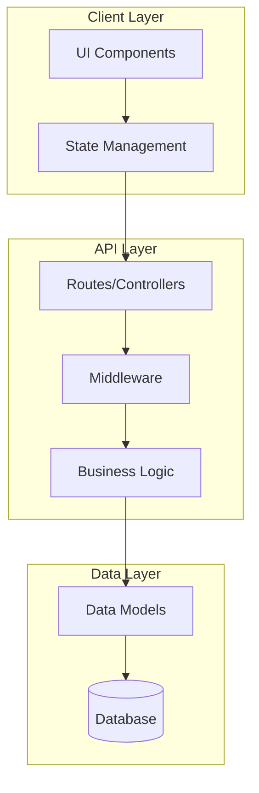
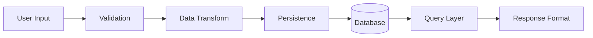

# {PROJECT_NAME} - Architecture

**Date:** {DATE}
**Type:** {PROJECT_TYPE}

## System Overview

{HIGH_LEVEL_DESCRIPTION}

## Architecture Diagram

## Technology Stack

| Category | Technology | Version | Purpose |
|----------|------------|---------|---------|
| **Runtime** | {RUNTIME} | {VERSION} | {PURPOSE} |
| **Framework** | {FRAMEWORK} | {VERSION} | {PURPOSE} |
| **Language** | {LANGUAGE} | {VERSION} | {PURPOSE} |
| **Database** | {DATABASE} | {VERSION} | {PURPOSE} |
| **ORM/Query** | {ORM} | {VERSION} | {PURPOSE} |
| **Testing** | {TEST_FRAMEWORK} | {VERSION} | {PURPOSE} |
| **Build Tool** | {BUILD_TOOL} | {VERSION} | {PURPOSE} |

## Architecture Pattern

**Pattern:** {ARCHITECTURE_PATTERN}

{PATTERN_DESCRIPTION}

### Key Characteristics
- {CHARACTERISTIC_1}
- {CHARACTERISTIC_2}
- {CHARACTERISTIC_3}

## Component Architecture

### {COMPONENT_LAYER_1}
{LAYER_DESCRIPTION}

**Key Components:**
| Component | Location | Responsibility |
|-----------|----------|----------------|
| {NAME} | `{PATH}` | {RESPONSIBILITY} |

### {COMPONENT_LAYER_2}
{LAYER_DESCRIPTION}

**Key Components:**
| Component | Location | Responsibility |
|-----------|----------|----------------|
| {NAME} | `{PATH}` | {RESPONSIBILITY} |

## Data Architecture

### Data Flow

### Data Models Overview
{DATA_MODELS_SUMMARY}

### Key Entities
| Entity | Table/Collection | Primary Relationships |
|--------|------------------|----------------------|
| {ENTITY} | `{TABLE}` | {RELATIONSHIPS} |

## API Design

### API Style
{API_STYLE_DESCRIPTION}

### Endpoint Categories
| Category | Base Path | Auth Required | Description |
|----------|-----------|---------------|-------------|
| {CATEGORY} | `{PATH}` | {YES/NO} | {DESCRIPTION} |

### Authentication & Authorization
{AUTH_DESCRIPTION}

## Security Architecture

### Security Measures
- **Authentication:** {AUTH_METHOD}
- **Authorization:** {AUTHZ_METHOD}
- **Data Protection:** {DATA_PROTECTION}
- **Input Validation:** {VALIDATION_APPROACH}

### Security Considerations
{SECURITY_NOTES}

## Error Handling

### Error Strategy
{ERROR_HANDLING_APPROACH}

### Error Categories
| Category | HTTP Status | Handling |
|----------|-------------|----------|
| Validation | 400 | {HANDLING} |
| Authentication | 401 | {HANDLING} |
| Authorization | 403 | {HANDLING} |
| Not Found | 404 | {HANDLING} |
| Server Error | 500 | {HANDLING} |

## Testing Strategy

### Test Levels
| Level | Location | Framework | Coverage Target |
|-------|----------|-----------|-----------------|
| Unit | `tests/unit/` | {FRAMEWORK} | {TARGET}% |
| Integration | `tests/integration/` | {FRAMEWORK} | {TARGET}% |
| E2E | `tests/e2e/` | {FRAMEWORK} | Critical paths |

### Testing Approach
{TESTING_PHILOSOPHY}

## Performance Considerations

### Caching Strategy
{CACHING_APPROACH}

### Optimization Patterns
- {OPTIMIZATION_1}
- {OPTIMIZATION_2}

## Deployment Architecture

### Environment Overview
| Environment | Purpose | URL |
|-------------|---------|-----|
| Development | Local development | localhost:{PORT} |
| Staging | Pre-production testing | {STAGING_URL} |
| Production | Live environment | {PROD_URL} |

### Infrastructure
{INFRASTRUCTURE_DESCRIPTION}

## Dependencies

### External Services
| Service | Purpose | Integration |
|---------|---------|-------------|
| {SERVICE} | {PURPOSE} | {HOW_INTEGRATED} |

### Key Libraries
{KEY_DEPENDENCIES_LIST}

## Architectural Decisions

### Key Decisions Made
1. **{DECISION_1}:** {RATIONALE}
2. **{DECISION_2}:** {RATIONALE}

### Trade-offs
{TRADEOFFS_DISCUSSION}

## Future Considerations

{FUTURE_ARCHITECTURE_NOTES}

---

_Architecture documentation for AI-assisted development_
