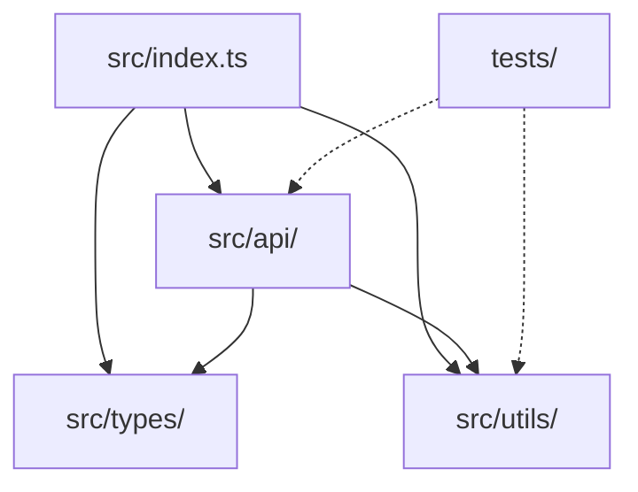

# {PROJECT_NAME} - Source Tree Analysis

**Date:** {DATE}

## Overview

{SOURCE_TREE_OVERVIEW}

## Complete Directory Structure

```
{PROJECT_NAME}/
├── src/                        # Main source code
│   ├── api/                   # API layer
│   │   ├── client.ts         # API client [ENTRY]
│   │   ├── http-client.ts    # HTTP utilities
│   │   └── services/         # Service modules
│   │       ├── players.ts    # Player service
│   │       └── matches.ts    # Match service
│   ├── components/            # UI components (if applicable)
│   │   ├── common/           # Shared components
│   │   └── features/         # Feature-specific components
│   ├── types/                 # TypeScript type definitions
│   │   ├── api.ts            # API types
│   │   ├── models.ts         # Domain models
│   │   └── index.ts          # Type exports
│   ├── utils/                 # Utility functions
│   │   ├── helpers.ts        # General helpers
│   │   └── constants.ts      # Constants
│   └── index.ts               # Main entry point [ENTRY]
├── tests/                      # Test files
│   ├── unit/                  # Unit tests
│   │   └── *.test.ts
│   ├── integration/           # Integration tests
│   │   └── *.test.ts
│   └── setup.ts               # Test configuration
├── dist/                       # Build output [GENERATED]
├── docs/                       # Documentation
├── package.json               # Dependencies & scripts
├── tsconfig.json              # TypeScript config
├── README.md                  # Project readme
└── .env.example               # Environment template
```

## Critical Directories

### `src/`

**Purpose:** Main source code directory
**Contains:** All application logic, types, and utilities
**Entry Points:** `src/index.ts`

Key subdirectories:
- `api/` - External API communication
- `types/` - TypeScript definitions
- `utils/` - Shared utilities

### `src/api/`

**Purpose:** API client and service layer
**Contains:** HTTP client, service modules, request handling
**Pattern:** Service-based API abstraction

Files handle:
- HTTP request/response
- Authentication
- Error handling
- Response transformation

### `src/types/`

**Purpose:** TypeScript type definitions
**Contains:** Interfaces, types, enums
**Pattern:** Centralized type management

Organizes types by:
- API response shapes
- Domain models
- Utility types

### `tests/`

**Purpose:** Test files organized by type
**Contains:** Unit tests, integration tests, test utilities
**Framework:** {TEST_FRAMEWORK}

Structure:
- `unit/` - Isolated component tests
- `integration/` - Cross-component tests
- `setup.ts` - Test configuration

## Entry Points

### Main Entry
- **File:** `src/index.ts`
- **Purpose:** Public API exports
- **Exports:** Main classes, functions, types

### Additional Entry Points
| Entry | Purpose | Used By |
|-------|---------|---------|
| `src/api/client.ts` | API client initialization | Consumers |
| `src/types/index.ts` | Type definitions | TypeScript consumers |

## File Organization Patterns

### Naming Conventions

| Pattern | Usage | Example |
|---------|-------|---------|
| `*.ts` | TypeScript source | `client.ts` |
| `*.test.ts` | Test files | `client.test.ts` |
| `*.d.ts` | Type declarations | `api.d.ts` |
| `index.ts` | Directory exports | `types/index.ts` |

### Directory Conventions

| Pattern | Purpose |
|---------|---------|
| `__tests__/` | Co-located tests |
| `__mocks__/` | Mock implementations |
| `types/` | Type definitions |
| `utils/` | Utility functions |

### Import Patterns

```typescript
// Relative imports for local modules
import { helper } from './utils/helpers';

// Alias imports (if configured)
import { ApiClient } from '@/api/client';

// Type imports
import type { User } from './types';
```

## Key File Types

### Source Files (`*.ts`)

- **Pattern:** `{name}.ts`
- **Purpose:** Main implementation files
- **Location:** `src/**/*.ts`

### Test Files (`*.test.ts`)

- **Pattern:** `{name}.test.ts` or `{name}.spec.ts`
- **Purpose:** Test implementations
- **Location:** `tests/**/*.test.ts`

### Configuration Files

| File | Purpose |
|------|---------|
| `package.json` | Dependencies, scripts |
| `tsconfig.json` | TypeScript configuration |
| `.env` | Environment variables |
| `biome.json` / `.eslintrc` | Linting rules |

## Asset Locations

| Asset Type | Location | File Types |
|------------|----------|------------|
| Static assets | `public/` | Images, fonts |
| JSON data | `src/assets/` | `.json` files |
| Styles | `src/styles/` | `.css`, `.scss` |

## Configuration Files

| File | Purpose |
|------|---------|
| `package.json` | Project manifest and dependencies |
| `tsconfig.json` | TypeScript compiler options |
| `biome.json` | Code formatting and linting |
| `.env.example` | Environment variable template |
| `.gitignore` | Git ignore patterns |

## Build Output

### `dist/`

**Purpose:** Compiled JavaScript output
**Generated By:** `npm run build`
**Contents:**
- `.js` files - Compiled JavaScript
- `.d.ts` files - Type declarations
- `.js.map` files - Source maps

**Note:** This directory is gitignored and generated on build.

## Development Notes

### Quick Navigation

| To find... | Look in... |
|------------|------------|
| Public API | `src/index.ts` |
| Types | `src/types/` |
| API calls | `src/api/` |
| Utilities | `src/utils/` |
| Tests | `tests/` |

### File Relationships



### Adding New Features

1. **New service:** Add to `src/api/services/`
2. **New types:** Add to `src/types/`
3. **New utility:** Add to `src/utils/`
4. **New test:** Add to `tests/unit/` or `tests/integration/`
5. **Export:** Update `src/index.ts` if public

---

_Source tree analysis for AI-assisted development_
