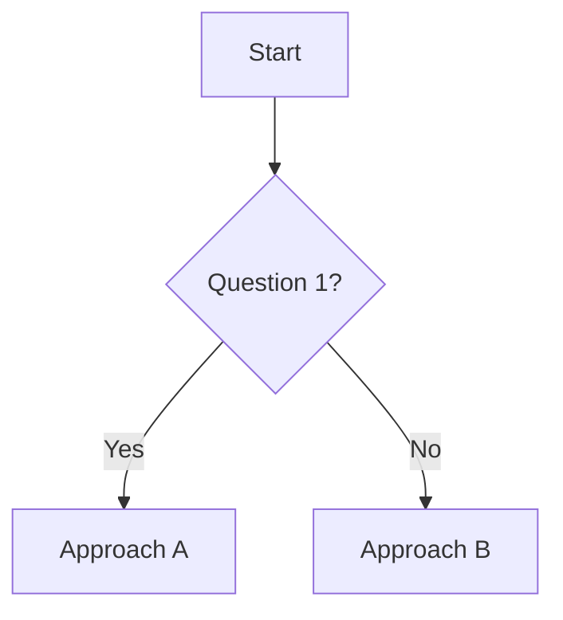

# Skills Library

## Overview

Skills are domain-specific knowledge documents that provide specialized guidance for common tasks. They use progressive disclosure for efficient context loading, where Copilot first reads metadata and only loads full content when relevant.

Skills are stored in `copilot/skills/<skill-name>/SKILL.md`. Copy them to `.github/skills/` in your project for VS Code auto-discovery.

## Available Skills

| Skill | Description |
|-------|-------------|
| [`azure-devops-cli`](../copilot/skills/azure-devops-cli/SKILL.md) | Azure DevOps CLI for projects, repos, pipelines, PRs, work items |
| [`code-review`](../copilot/skills/code-review/SKILL.md) | Code review checklist and guidelines |
| [`gh-cli`](../copilot/skills/gh-cli/SKILL.md) | GitHub CLI comprehensive reference |
| [`project-documentation`](../copilot/skills/project-documentation/SKILL.md) | Brownfield project documentation and analysis |

## Skill File Format

Each skill has a `SKILL.md` file with YAML frontmatter:

```markdown
---
name: skill-name
description: What it does AND when to use it. Be specific for better auto-activation.
---

# Skill Title

## When to Use
- Scenario 1
- Scenario 2

## Decision Tree
Flowchart for choosing the right approach

## Recommended Approach
Opinionated best practice with examples

## Pitfalls and Gotchas
Common mistakes to avoid

## Code Examples
Practical, copy-paste ready code
```

## Frontmatter Fields

| Field | Type | Required | Description |
|-------|------|----------|-------------|
| `name` | string | Yes | Skill identifier for discovery |
| `description` | string | Yes | Purpose AND activation triggers (be specific) |

## How Skills Work

Skills use **progressive disclosure**:

1. **Discovery** - Copilot reads `name` and `description` from frontmatter
2. **Matching** - Your prompt is compared against skill descriptions
3. **Loading** - When a match is found, the full skill content loads
4. **Resources** - Additional files in the skill directory load on-demand

### Auto-Activation

Skills activate automatically based on prompt matching. Write specific descriptions:

```yaml
# Less effective - too generic
description: "Help with GitHub"

# More effective - specific triggers
description: "GitHub CLI (gh) commands for PRs, issues, repos, and workflows"
```

## Skill Structure

### Basic Structure

```
copilot/skills/
  my-skill/
    SKILL.md           # Main skill file (required)
```

### Extended Structure

```
copilot/skills/
  my-skill/
    SKILL.md           # Main skill file
    examples.md        # Code examples
    templates/         # Template files
      component.md
      service.md
    scripts/           # Helper scripts
      setup.sh
```

## Using Skills

### Automatic (Recommended)
Simply describe your task - skills activate when relevant:
```
Help me create a pull request for this feature
→ gh-cli skill activates automatically
```

### Explicit Reference
Reference a skill directly in your prompt:
```
Use the azure-devops-cli skill to help me create a pipeline.
```

### Quick Reference
Open skill documents directly when facing related decisions.

## Creating New Skills

### 1. Create Directory Structure

```bash
mkdir -p copilot/skills/my-skill
```

### 2. Create SKILL.md

```markdown
---
name: my-skill
description: Specific description with activation keywords
---

# My Skill

## When to Use
- Scenario 1: When you need to...
- Scenario 2: When dealing with...

## Decision Tree



## Recommended Approach

### Step 1: Setup
```bash
# Example command
npm install my-package
```

### Step 2: Configuration
```json
{
  "setting": "value"
}
```

## Pitfalls and Gotchas

- **Common Mistake 1**: Explanation and fix
- **Common Mistake 2**: Explanation and fix

## Code Examples

### Basic Usage
```typescript
// Example code
const result = doSomething();
```

### Advanced Usage
```typescript
// More complex example
const advanced = doSomethingComplex({
  option: true
});
```
```

### 3. Add Supporting Files (Optional)

Create additional files for complex skills:
- `examples.md` - Extended code examples
- `templates/` - Template files for scaffolding
- `reference.md` - API or command reference

### 4. Deploy

Copy to your project's `.github/skills/` for auto-discovery:

```bash
cp -r copilot/skills/my-skill .github/skills/
```

## Best Practices

### Description Quality
- Include specific keywords that trigger activation
- Mention the tools, technologies, or scenarios covered
- Be concise but comprehensive

### Content Organization
- Start with "When to Use" for quick scanning
- Include decision trees for complex choices
- Provide copy-paste ready examples
- Document common mistakes

### Progressive Disclosure
- Keep SKILL.md focused on core content
- Move extended examples to separate files
- Link to external resources when appropriate

### Maintenance
- Update examples when APIs change
- Add new pitfalls as they're discovered
- Version skills for breaking changes

## Skill vs Instructions vs Prompts

| Feature | Skills | Instructions | Prompts |
|---------|--------|--------------|---------|
| **Purpose** | Domain knowledge | Coding guidelines | Task templates |
| **Activation** | Auto (by topic) | Auto (by file type) | Manual (by command) |
| **Scope** | Specific domain | All code generation | Single task |
| **Size** | Comprehensive | Concise | Variable |
| **Structure** | Decision trees, examples | Rules, guidelines | Input/output format |

### When to Use Each

- **Skills**: Deep expertise on a topic (CLI tools, frameworks, patterns)
- **Instructions**: Coding style and conventions (formatting, naming, practices)
- **Prompts**: Repeatable workflows (bug fix, review, documentation)

## Example: CLI Skill Structure

```markdown
---
name: gh-cli
description: GitHub CLI (gh) for repos, PRs, issues, actions, and releases
---

# GitHub CLI Reference

## When to Use
- Creating or managing pull requests
- Working with GitHub issues
- Managing GitHub Actions workflows
- Creating releases

## Quick Reference

| Command | Purpose |
|---------|---------|
| `gh pr create` | Create pull request |
| `gh pr merge` | Merge pull request |
| `gh issue create` | Create issue |
| `gh run list` | List workflow runs |

## Common Workflows

### Create and Merge PR
```bash
gh pr create --title "Feature" --body "Description"
gh pr merge --squash
```

### List Open Issues
```bash
gh issue list --state open --label bug
```

## Pitfalls

- **Authentication**: Run `gh auth login` first
- **Default Branch**: Use `--base main` if not default
- **Rate Limits**: Cache responses for bulk operations
```

## Deployment

Copy all skills to your project:

```bash
cp -r copilot/skills/* .github/skills/
```

Or copy specific skills:

```bash
cp -r copilot/skills/gh-cli .github/skills/
```

### Verification

Skills in `.github/skills/` are automatically discovered by VS Code Copilot. Verify by:
1. Opening Copilot Chat
2. Typing a relevant prompt
3. Checking if the skill is referenced in the response
